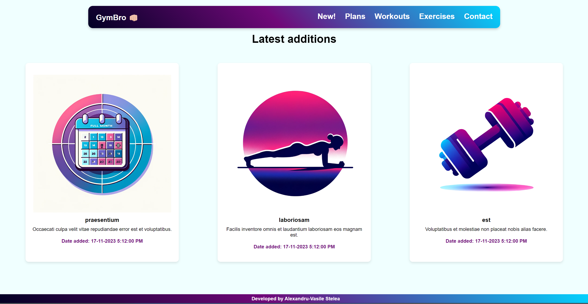
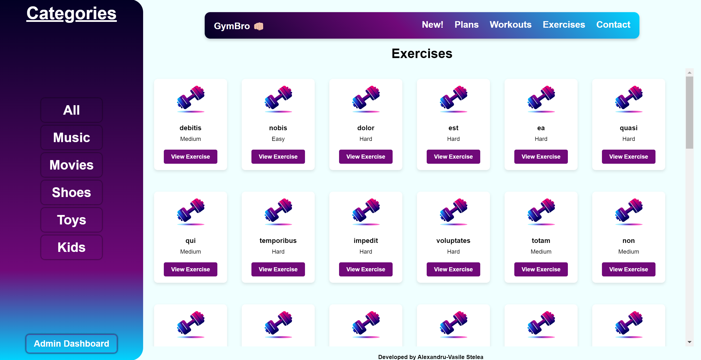
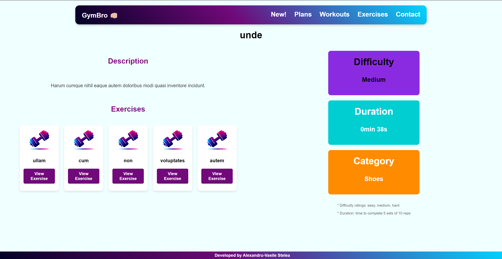
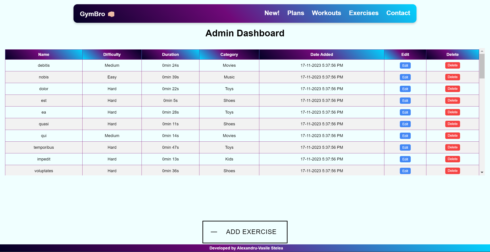

# GymBro Web App

## Overview

GymBro is a web application for managing and accessing fitness-related content, including exercises, workouts, and plans. It employs Node.js for backend operations, HTML, CSS, and EJS for frontend development, and MongoDB for database management.

## Technical Features

- **Entity Management**: Categorized management of exercises, workouts, and plans with attributes such as description and duration.
- **Category-Based Sorting**: Efficient data organization and retrieval based on fitness categories.
- **Search Functionality**: A robust search tool for quick retrieval of entities based on various criteria.
- **Detailed Entity View**: Detailed presentation of each entity, showcasing all relevant attributes.
- **Admin Dashboard**: A dashboard for administrators to perform CRUD operations on all entities.

## Technologies

- **Backend**: Node.js
- **Frontend**: HTML, CSS, EJS
- **Database**: MongoDB

## Screenshots

1. **Main Page**:
   

2. **Explorer**:
   

3. **Entity Detailed View**:
   

4. **Admin Dashboard**:
   

## Checking the WebApp

To set up and check GymBro, follow these steps:

1. **Clone the Repository**: Clone the GymBro repository to your local machine.
2. **Install MongoDB**: Ensure MongoDB is installed and running on your system.
3. **Initialize Node Project**:
   - Navigate to the cloned directory.
   - Run `npm install` to install all necessary dependencies.
   - Ensure Node.js is properly installed on your system.
4. **Set Up Database**:
   - Create a new database named `GymBro` in MongoDB.
5. **Environment Variables**:
   - Create a `.env` file in the root directory of the project.
   - Add `MONGO_URI=<your_mongodb_connection_string>` to the `.env` file.
6. **Run Fake Data Generator**:
   - Use the provided script or utility to populate the database with fake data.
